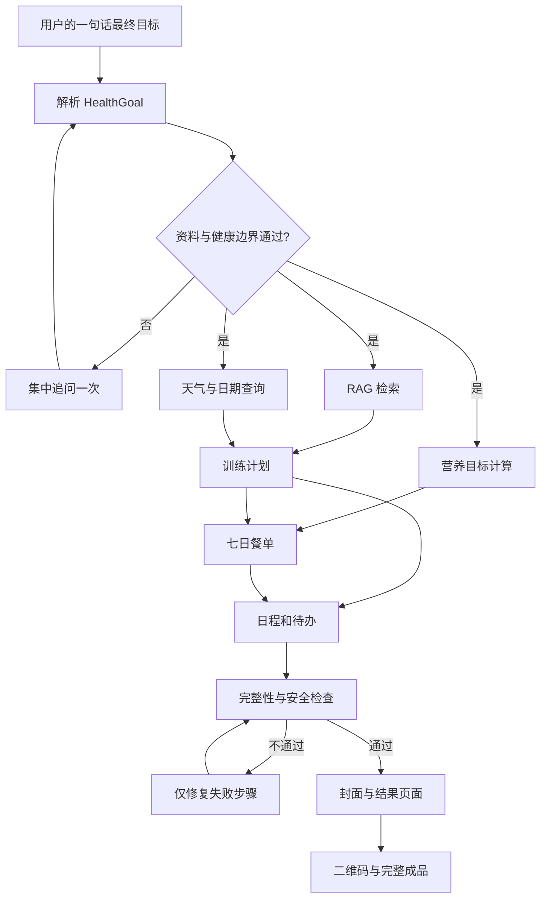

# 自主规划型 Agent 设计：大学生智能健康生活规划 Agent

## 一、场景目标

面向希望改善增肌、减脂、体能或规律作息的健康大学生。用户只需要描述最终目标和已有条件，Agent 自动完成资料检查、天气查询、营养计算、训练安排、日程编排、购物清单、风险提示和成品发布，最终交付一份可直接执行、可扫码查看的七日健康生活方案。

推荐演示输入：

> 帮我制定一份未来 7 天的增肌健康生活方案。我 20 岁，男，身高 175 厘米，体重 65 公斤，每周训练 4 次，每次 60 分钟，住在新乡市，每天吃 4 餐，身体健康且没有食物过敏。最后生成一份可以扫码查看的完整计划。

用户不需要说明先查什么、调用哪些工具或者怎样安排步骤。Agent 应自行规划；只有缺少年龄、身高、体重、目标、城市、健康确认等关键条件且无法安全推断时，才集中追问一次。

## 二、业务边界与安全约束

- 第一版仅面向完成健康确认、没有食物过敏的健康成年人。
- 输出属于一般健康生活建议，不作疾病诊断，不替代医生、营养师或康复师。
- 用户提到疾病、受伤、孕期、进食障碍、药物影响或明显不适时，停止自动生成高强度计划，建议咨询专业人员。
- 不执行购买、付款、预约或向第三方发送信息等外部副作用操作。
- 饮食和训练数据只保存在内存任务状态中，默认 30 分钟过期，程序重启后清除。
- 最终结果必须标明数据来源、计算假设和安全提示，不允许模型编造天气、热量或身体数据。

## 三、最终交付物

Agent 最终只发送一份结构完整的成品，而不是多条互不关联的回答。成品包括：

1. 用户目标与身体资料摘要。
2. 七日天气概览及室内外训练判断。
3. 每日训练主题、动作建议、时长和恢复安排。
4. 训练日与休息日饮食、每日热量和三大营养素目标。
5. 一周购物清单、饮水和睡眠建议。
6. 每日时间表及可执行待办事项。
7. 风险提示、替代动作和天气备用方案。
8. 健康计划封面图。
9. 手机结果展示页面和二维码。
10. 计划完整性检查结果及免责声明。

## 四、Agent 自动拆解的任务

| 步骤 | 子任务 | 能力 | 依赖 | 主要产物 |
| --- | --- | --- | --- | --- |
| 1 | 解析最终目标与约束 | LLM 结构化输出 | 无 | `HealthGoal` |
| 2 | 校验必填信息和健康边界 | 本地规则 | 步骤 1 | 校验结果或一次性追问 |
| 3 | 检索健康生活参考资料 | RAG | 步骤 1 | 带来源的参考片段 |
| 4 | 查询未来天气 | 天气、日期工具 | 步骤 1 | 每日天气与发布时间 |
| 5 | 计算热量和营养素 | 增肌饮食 Skill、计算工具 | 步骤 2 | 营养目标 |
| 6 | 生成一周训练框架 | 运动健康 Skill | 步骤 2、3、4 | 每日训练草案 |
| 7 | 生成训练日和休息日餐单 | 增肌饮食 Skill | 步骤 3、5、6 | 七日餐单 |
| 8 | 编排日程、购物清单和待办 | 待办、时间工具和 LLM | 步骤 6、7 | 可执行清单 |
| 9 | 校验天气、热量、训练和时间冲突 | 本地检查器 | 步骤 4—8 | `EvaluationReport` |
| 10 | 生成健康计划封面 | 图片生成工具 | 步骤 6、7 | 封面图片 |
| 11 | 汇总结果展示页面 | 结果页工具 | 步骤 8—10 | 页面 URL |
| 12 | 为结果页面生成二维码 | 二维码工具 | 步骤 11 | 二维码图片和最终回复 |

步骤 3、4、5 在资料完整后可以并行。步骤 6 依赖天气，步骤 7 依赖营养目标和训练安排，步骤 9 必须等待核心计划完成，结果页面和二维码必须最后串行执行。



## 五、RAG、Skill 与 Tool 的分工

| 类型 | 本场景职责 | 规则 |
| --- | --- | --- |
| RAG | 检索营养、训练、安全提示和项目使用知识 | 只提供参考事实，保留文档 ID 和来源，不直接执行动作 |
| 增肌饮食 Skill | 收集/复用身体资料，计算营养目标并生成餐单 | 数值由本地计算，不让模型自由编造 |
| 运动健康 Skill | 结合目标、频率、时长和天气形成训练安排 | 受健康边界约束，天气来自真实工具 |
| 快速计算 Skill/计算工具 | 校验热量、营养素、训练时长和汇总数值 | 使用统一计算能力，不能重复实现表达式引擎 |
| JSON 格式化 Skill | 调试时展示计划和步骤状态 | 属于辅助能力，不强行出现在用户成品中 |
| 冷笑话 Skill | 可选生成每日鼓励或轻松提示 | 不是主流程必需步骤，失败不能影响计划 |
| 天气、日期工具 | 获取真实天气、日期和星期 | 保留数据发布时间，失败时明确标记不可用 |
| 待办工具 | 将每日执行事项变成用户待办 | 写操作保持串行，避免重复添加 |
| 图片、结果页、二维码工具 | 交付封面和可扫码成品 | 依赖前面已验证的最终方案 |
| LLM | 理解目标、生成计划、组织文字和修复方案 | 不替代工具生成事实或数值 |

为避免 Skill 互相调用造成耦合，后续实现时应把现有 Skill 中可复用的业务逻辑下沉为 `NutritionPlanningService` 和 `ExercisePlanningService`。用户直接调用 Skill 与 Agent 编排都复用这两个服务。

## 六、总体架构决策（ADR）

### 背景与约束

- 当前项目是 Java 21、Spring Boot 4.1 的模块化单体，通过微信 iLink 长轮询运行。
- 团队人数有限，需要在短周期内完成可演示、可测试的闭环。
- 已有统一的 Skill、RAG、Tool Registry、Function Calling 和并行工具调用机制。
- 健康计划存在明确的数据依赖和安全边界，不能完全依赖模型自由循环。
- 第一版状态允许保存在内存中，不要求分布式部署和跨进程恢复。

### 方案比较

| 方案 | 优点 | 问题 | 结论 |
| --- | --- | --- | --- |
| 只扩展现有 Function Calling 自由循环 | 改动最少，模型自主性强 | 步骤不可预测，难保证交付完整、安全校验和失败恢复 | 不采用 |
| 模块化单体中的受控 Planner/Executor 状态机 | 可自主拆解，同时能限制步骤、依赖、重试和安全规则；容易测试与部署 | 需要新增计划、状态和调度模型 | 采用 |
| 微服务或外部工作流引擎 | 扩展性和持久化能力强 | 部署、通信、监控和团队认知成本过高 | 暂不采用 |

### 最终决策

在现有 Spring Boot 项目内增加有边界的“规划—执行—检查—交付”Agent 模块。模型负责理解和规划，本地状态机负责控制执行；无依赖的只读步骤可以并行，有数据依赖或副作用的步骤严格串行。

这一方案保持单 JAR 部署和内存一致性，测试时可以替换每个执行器；代价是需要显式维护步骤类型和状态。未来需要跨进程恢复时，只替换状态仓库和调度实现，无须重写 Skill、RAG 与 Tool。

## 七、建议代码结构

```text
src/main/java/com/summercamp/project/agent/
├── AgentRouter.java                  # 判断是否为长任务目标
├── HealthPlanAgent.java              # 场景入口和总编排
├── planning/
│   ├── GoalParser.java               # 一句话目标转结构化数据
│   ├── HealthGoalValidator.java      # 必填字段和健康边界
│   ├── TaskPlanner.java              # 生成带依赖的任务计划
│   └── PlanPolicy.java               # 步骤数、重试和允许能力白名单
├── execution/
│   ├── TaskScheduler.java            # 串并行调度
│   ├── StepExecutor.java             # 步骤执行接口
│   ├── RagStepExecutor.java
│   ├── SkillStepExecutor.java
│   └── ToolStepExecutor.java
├── evaluation/
│   ├── HealthPlanEvaluator.java      # 数值、天气和时间冲突检查
│   └── EvaluationReport.java
├── artifact/
│   ├── HealthPlanAssembler.java      # 最终文档模型
│   └── HealthPlanPageService.java    # 通用结果页面
├── model/
│   ├── HealthGoal.java
│   ├── AgentPlan.java
│   ├── AgentStep.java
│   ├── AgentRun.java
│   └── StepStatus.java
└── store/
    ├── AgentRunStore.java
    └── InMemoryAgentRunStore.java
```

现有 `message`、`rag`、`skill`、`tool`、`weather` 模块继续保留。Agent 通过公开接口调用它们，不复制内部实现。

## 八、核心数据模型

### 1. 结构化目标 `HealthGoal`

```json
{
  "goalType": "MUSCLE_GAIN",
  "days": 7,
  "gender": "MALE",
  "age": 20,
  "heightCm": 175,
  "weightKg": 65,
  "location": "河南省新乡市",
  "trainingDaysPerWeek": 4,
  "minutesPerSession": 60,
  "mealsPerDay": 4,
  "activityLevel": "MODERATE",
  "healthConfirmed": true,
  "foodAllergies": [],
  "delivery": ["TEXT", "WEB_PAGE", "QR_CODE"]
}
```

模型输出必须经过 JSON Schema 和本地范围校验，例如年龄 18—70、身高 120—230 厘米、体重 30—250 千克、计划 3—14 天。模型不能用默认值伪造用户没有确认的健康状态。

### 2. 计划步骤 `AgentStep`

```json
{
  "id": "generate-exercise-plan",
  "type": "SKILL",
  "capability": "exercise-health-advice",
  "dependsOn": ["retrieve-health-knowledge", "query-weather"],
  "status": "PENDING",
  "attempt": 0,
  "maxAttempts": 2,
  "inputRefs": ["goal", "ragContext", "weatherReport"],
  "outputKey": "exercisePlan"
}
```

步骤状态固定为 `PENDING`、`RUNNING`、`SUCCEEDED`、`FAILED`、`SKIPPED`。任务计划最多 12 步，每步最多重试 2 次，禁止模型临时调用白名单外的能力。

### 3. 运行状态 `AgentRun`

一次运行保存用户 ID、目标、计划、每步输入输出、错误、创建时间、过期时间和最终成品引用。运行状态按微信用户隔离，重复消息通过现有消息去重机制拦截。

## 九、调度与执行规则

1. `GoalParser` 使用结构化输出解析目标，本地验证器负责最终可信校验。
2. `TaskPlanner` 只能从预定义步骤类型和能力白名单生成计划。
3. `TaskScheduler` 根据 `dependsOn` 构建有向无环图；发现环、缺失依赖或重复输出键时拒绝执行。
4. 同一批次中无依赖且只读的 RAG、天气、时间、计算任务使用 Java 21 虚拟线程并行执行。
5. 待办写入、图片生成、结果页面和二维码等步骤保持串行，并设置幂等键防止重试产生重复结果。
6. 后一步只读取前一步已经成功写入的结构化结果，不从自然语言回复中猜测数据。
7. 单个可选步骤失败时记录降级结果；核心天气、营养或训练步骤失败时停止交付并说明可恢复位置。
8. `HealthPlanEvaluator` 不通过时只生成修复步骤，最多修复两轮，不能重新执行整套计划。

## 十、消息路由

完整路由建议调整为：

```text
微信消息
→ 是否存在待补充 Agent 目标？是：合并资料并继续
→ 是否命中 /clear、/help 等确定命令？是：执行命令
→ 是否是健康长任务目标？是：HealthPlanAgent
→ 是否命中单个 Skill？是：执行 Skill
→ 是否命中普通图片、天气等业务意图？是：执行原流程
→ 是否命中 RAG？是：增强 Prompt 后调用 LLM
→ 否则：LLM 闲聊
```

“帮我算一下 BMI”属于单工具或普通聊天，不应启动长任务；“帮我制定未来 7 天增肌计划并生成二维码”才进入 Agent。识别不确定时可以使用结构化意图分类，但分类失败必须回退到原有聊天流程。

## 十一、失败处理与用户体验

- 开始执行时先回复“已开始规划，将检查天气、饮食和训练安排”。
- 超过 10 秒仍未完成时，可以按阶段发送一次进度，不逐步刷屏。
- 高德天气失败：保留室内训练保守方案，并在成品中标记天气待确认。
- RAG 未命中：继续执行，但不得声称使用了参考资料。
- LLM 临时失败：使用现有备用模型；仍失败则保存运行状态并提示可继续。
- 图片生成失败：交付文字和结果页面，图片属于可选降级项。
- 结果页或二维码失败：直接发送完整文字计划和具体失败原因。
- `/clear` 同时清理对话、待补充 Skill、天气请求和 Agent 运行状态。
- 日志只记录步骤 ID、状态、耗时和错误类型，不记录完整身体资料或 API Key。

## 十二、完整性检查规则

最终交付前至少检查：

- 七天是否每天都有训练/恢复安排和餐饮建议。
- 每周训练次数是否与用户目标一致，不能连续安排过多高强度训练。
- 室外训练是否避开明显恶劣天气，并提供室内替代方案。
- 每日热量和蛋白质目标是否由计算结果产生，汇总是否一致。
- 餐数、过敏信息和健康边界是否得到遵守。
- 购物清单能否覆盖餐单中的主要食材。
- 待办时间是否冲突，结果页面 URL 是否可访问。
- 最终回复是否包含来源、假设、风险提示和免责声明。

## 十三、测试与验收

### 单元测试

- 完整目标能够解析为 `HealthGoal`。
- 缺少多个字段时一次性列出所有缺失项，而不是逐条追问。
- 疾病、受伤和未确认健康状态会触发安全拦截。
- 计划依赖图正确，循环依赖和未知能力会被拒绝。
- 无依赖查询并行执行，有依赖步骤严格串行。
- 步骤重试不会重复添加待办或重复创建成品。
- 天气、RAG、图片和页面失败分别触发规定的降级策略。
- 评估器能识别训练次数、热量、日期和天气冲突。

### 集成测试

1. 输入完整演示目标，不再追问，自动完成至少 8 个步骤。
2. 输入缺少城市和健康确认的目标，只集中追问一次，补充后继续原运行。
3. 模拟天气超时，最终仍生成带室内备用方案的成品。
4. 模拟餐单热量不一致，Agent 只修复餐单和评估步骤。
5. 最终文字、页面和二维码内容一致，手机能打开结果页。
6. `/clear` 后不能继续读取此前健康计划状态。

### 演示验收标准

- 用户只输入一个最终目标，不提供执行步骤。
- Agent 自动拆解并执行不少于 3 个不同子任务。
- 至少使用 RAG、2 个 Skill 和 4 种 Tool。
- 演示中同时出现并行任务和依赖前一步结果的串行任务。
- 最终交付一份完整七日方案，而不是零散回复。
- 任一步失败时能够指出失败步骤并进行降级或恢复。

## 十四、团队模块划分

1. 目标与安全模块：`GoalParser`、JSON Schema、必填校验、健康边界。
2. 规划与状态模块：计划生成、依赖图、运行状态和内存仓库。
3. 调度与恢复模块：虚拟线程并行、串行依赖、超时、重试和幂等。
4. RAG 与 Skill 模块：健康知识、来源标注、营养和运动服务抽取。
5. 工具与成品模块：天气、计算、待办、图片、健康结果页和二维码。
6. 集成与验收模块：微信路由、进度反馈、日志、端到端测试和演示脚本。

所有成员都通过统一的 Agent、Skill 和 Tool 接口接入，禁止各自新增一套消息主路由。合并代码时按“能力名称唯一、结构化输入输出统一、测试覆盖更完整”的规则去重。

## 十五、分阶段实施顺序

### 第一阶段：最小可运行闭环

实现目标解析、固定计划模板、天气、营养、训练、结果汇总和文字回复。先确保一次输入能够稳定得到完整七日方案。

### 第二阶段：自主调度与成品

加入依赖图、并行执行、失败重试、完整性评估、结果页面、封面和二维码。

### 第三阶段：增强与演示

加入计划修复、进度消息、RAG 来源展示、待办同步和完整端到端演示脚本。只有实际出现跨进程恢复、多实例部署需求时，再把内存状态仓库升级为数据库或外部工作流系统。
